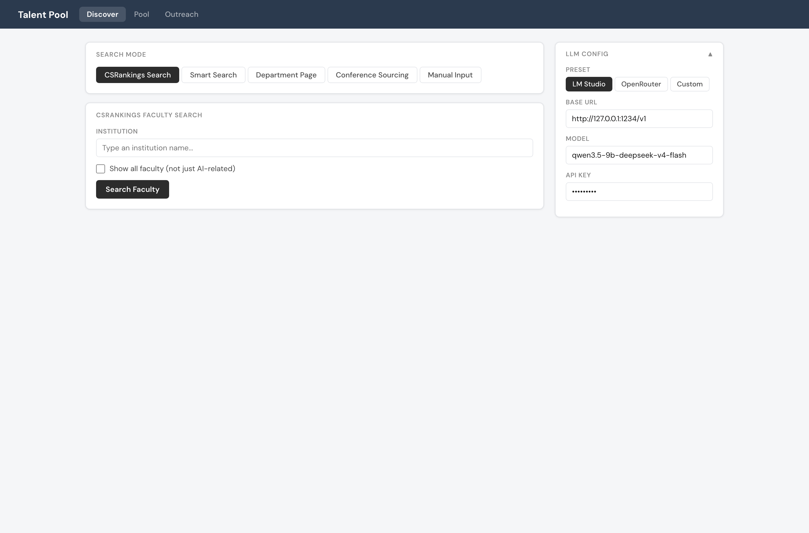
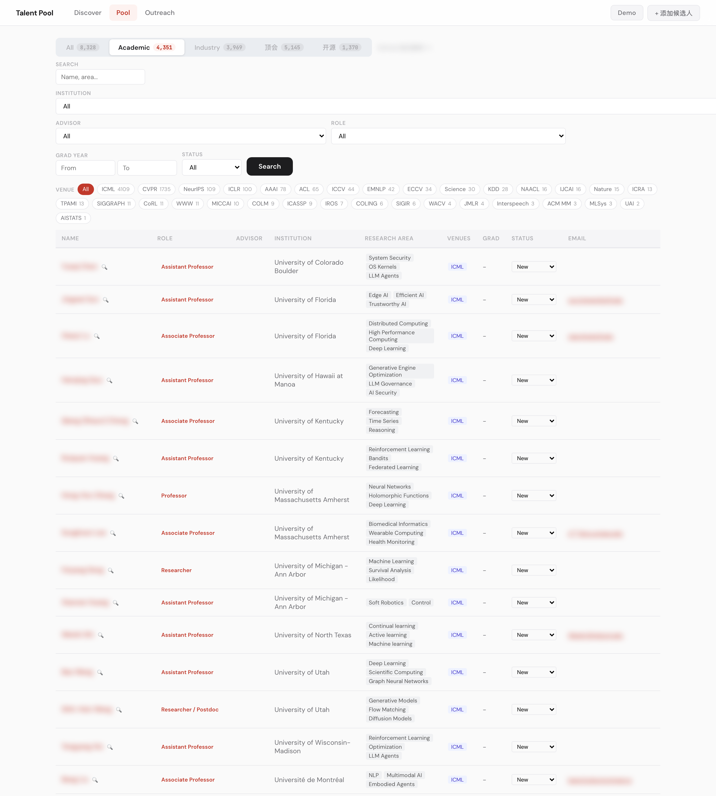
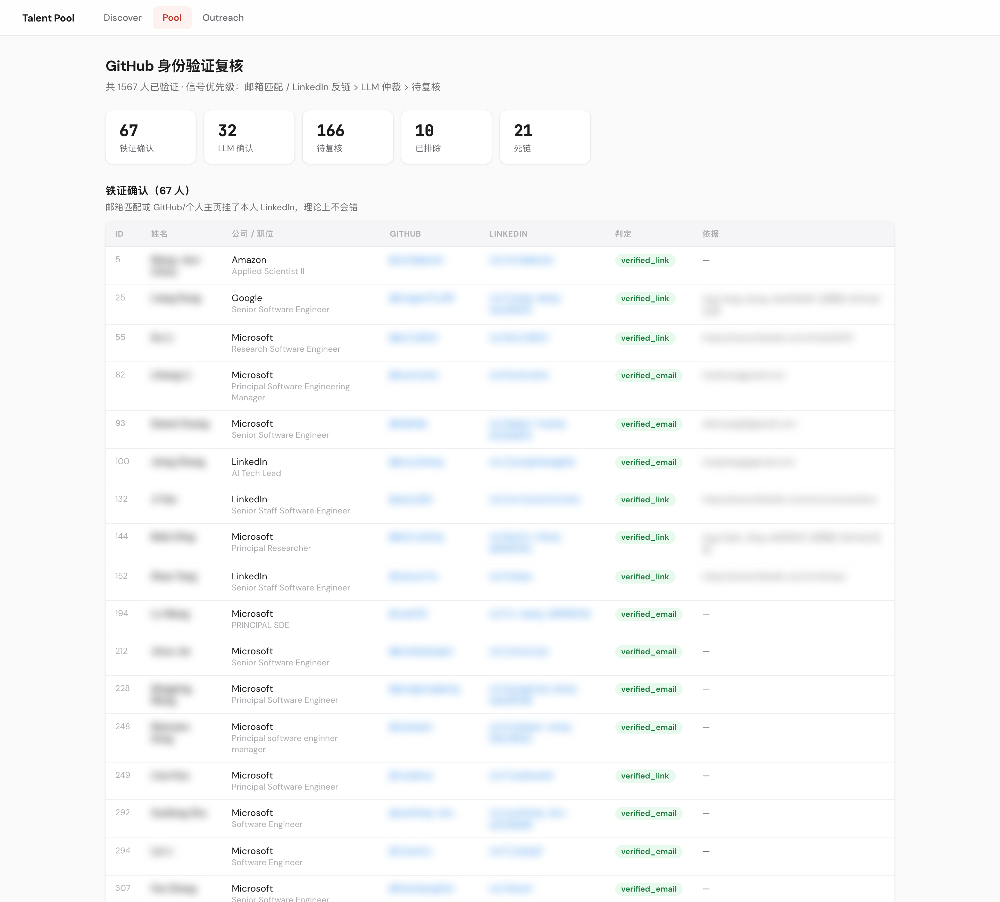

# Recruiting Any

[English](README.md)

本地优先的 AI 招聘平台。从学术实验室、顶级 AI 会议和业界发现候选人，统一管理人才库，生成个性化外联话术——全部在浏览器中完成，数据不出本机。


## 核心流程

```
Discover（发现）→  Pool（人才库）→  Outreach（外联）
```

### Discover — 批量发现候选人

五种寻源模式，一条导入流水线：

- **CSRankings 搜索**：按学校搜索 CS 教授，自动提取实验室成员（博士生、博后、研究员）
- **Smart Search**：输入任意教授主页或实验室页面，LLM 自动提取成员信息
- **院系页面抓取**：批量从大学院系页面提取教职信息
- **会议论文寻源**：从 NeurIPS / ICML / ICLR 拉取录用论文（OpenReview + 会议 virtual 页），筛选作者后用 arXiv HTML 补全机构和邮箱——论文匹配用双证据（标题相似度 × 作者重合度），预印本改名也不会认错
- **引用扩张**：从一个优质候选人出发，沿 Semantic Scholar 引用图找库外的相似人才

两阶段抓取架构成本极低：HTTP 快速抓取 + 每页单次 LLM 调用。支持 JS 渲染页面、跨域实验室网站、纯图标链接、超长页面智能截断。



### Pool — 统一人才库

- 全文搜索（FTS5）、布尔查询、**语义搜索**（LanceDB 向量）
- **All / Academic / Industry / 顶会 / 开源** 五个透镜——一个池子，按需切换视角
- 学术视图：按导师、学校、毕业年份、研究方向、**会议徽章**（ICML / NeurIPS / CVPR…）和 Pipeline 状态（新建 → 已联系 → 已回复 → 面试）筛选
- Insights 面板：公司分布、学历分布、院校排名、外联漏斗，以及可点击搜索的**研究方向词云**
- **GitHub 身份验证复核**：每条 GitHub 链接分层判定——铁证确认（邮箱匹配 / LinkedIn 反链）→ LLM 仲裁 → 待复核 → 已排除，避免联系错人
- 每位候选人的共同作者关系图
- Chrome 插件一键抓取 LinkedIn 档案





### Outreach — 个性化话术生成

- 三种模式：档案直推、开源社区、学术合作
- 中英双语
- 自动拉取候选人完整背景（工作经历、教育、论文、AI 提取的主页画像）生成个性化消息
- 候选人详情页一键生成；外联历史按人追踪，含回复状态


> 截图已脱敏：姓名、邮箱、头像和外联内容均已模糊或替换，保护候选人隐私。

## 快速开始

```bash
git clone https://github.com/alexlxy599/recruiting-any.git
cd recruiting-any
pip install flask anthropic openai requests beautifulsoup4 lxml duckduckgo-search python-dotenv lancedb
```

创建 `.env`（可选）：

```
GITHUB_TOKEN=ghp_...          # GitHub API，提升调用额度
ANTHROPIC_API_KEY=sk-ant-...  # Claude API，用于高质量话术生成
```

恢复人才库（私有仓库，dump 随代码一起分发）：

```bash
gzip -dc data/exports/talent.sql.gz | sqlite3 data.db
```

启动：

```bash
python app.py
```

访问 http://localhost:5055

### 更新 dump

`data.db` 本身仍然 gitignore——改成提交文本 dump，这样 git 存的是增量，而不是每次改动都塞一份全新的 34MB 二进制 blob：

```bash
sqlite3 data.db "PRAGMA wal_checkpoint(TRUNCATE);"
sqlite3 data.db .dump | gzip -n9 > data/exports/talent.sql.gz
```

> dump 含真实候选人隐私数据，本仓库必须保持 **private**。

## LLM 配置

支持多种 LLM 后端，在侧边栏或各模块内切换：

| 后端 | 适用场景 | 配置方式 |
|------|---------|---------|
| **LM Studio**（本地） | 免费、隐私、快速抓取 | 本地运行，端口 1234 |
| **OpenRouter** | DeepSeek、Qwen、Llama 等 | openrouter.ai 获取 API Key |
| **Anthropic** | 最佳话术质量 + 原生 Web 搜索 | console.anthropic.com 获取 Key |

Discover 抓取和批量补全用本地模型即可；Outreach 话术生成推荐 Claude。

## 架构

```
SQLite (data.db)  ←→  Flask API  ←→  Web UI
         ↕                ↕
    FTS5 + LanceDB    LLM（Anthropic / OpenAI 兼容 / 本地模型）
```

- **数据全部本地存储**——仅 LLM 调用走云端（可切换 Ollama/LM Studio 实现完全离线）
- 单一 SQLite 数据库，WAL 模式 + FTS5 全文搜索 + LanceDB 向量检索
- 无 React，无构建步骤——原生 HTML/CSS/JS
- `mcp_server.py` 把人才库暴露为 MCP server，可在 Claude Code 等 Agent 里直接查询候选人

## 项目结构

```
app.py                  # Flask 路由和 API
db.py                   # 数据库 Schema、迁移、所有 CRUD 操作
conference_scraper.py   # 会议论文寻源（OpenReview / 上传 / 作者筛选）
discover_s2.py          # Semantic Scholar 引用图扩张
fast_scraper.py         # 两阶段实验室抓取器
agent_scraper.py        # Agent 模式 Web 搜索
enrich_homepage.py      # 主页快照 → LLM 提取 → 规范化入库
enrich_github_repos.py  # GitHub 仓库信号
verify_github.py        # GitHub 身份分层验证
csrankings.py           # CSRankings 数据集成
mcp_server.py           # 人才库 MCP server
ai/
  embedder.py           # 向量化 + 语义搜索
templates/              # Discover / Pool / 详情 / 学术 / Outreach 页面
chrome-extension/       # LinkedIn 档案抓取插件
ingest/
  import_csv.py         # CSV 批量导入
  import_icml.py        # 会议作者导入
  import_competition.py # 数学/信息学竞赛获奖名单导入（丘赛等）
  build_coauthor_graph.py
migrations/             # 破坏性 schema 变更
```

## 技术栈

- **后端**：Python、Flask、SQLite + FTS5
- **前端**：原生 HTML/CSS/JS、Chart.js
- **抓取**：BeautifulSoup、Requests
- **LLM**：Anthropic SDK、OpenAI SDK（兼容 OpenRouter、LM Studio、Ollama）
- **检索**：LanceDB（向量）、FTS5（全文）、布尔查询解析器
- **数据源**：CSRankings、OpenReview、arXiv、GitHub API、Semantic Scholar、Google Scholar、DuckDuckGo

## License

Private project. All rights reserved.
