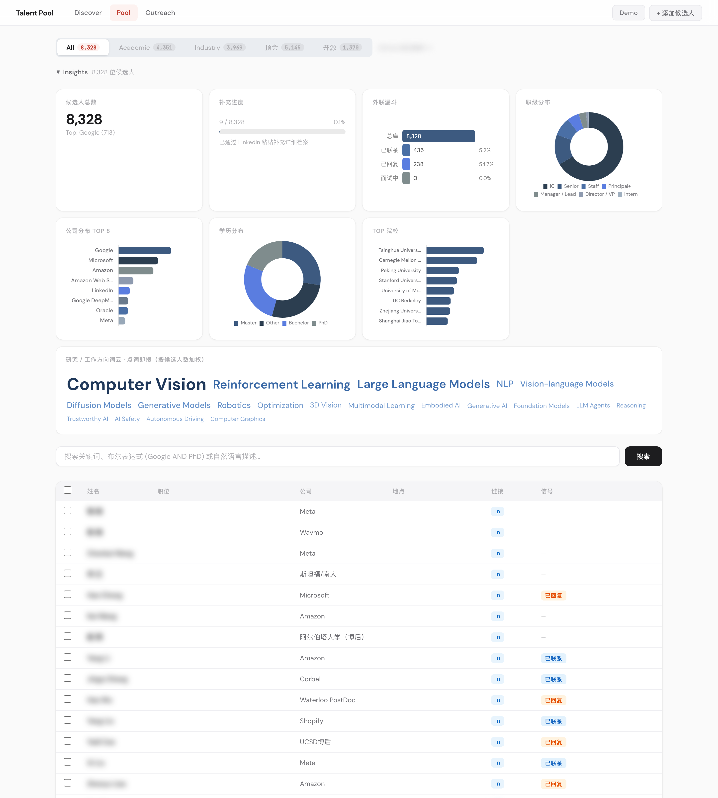
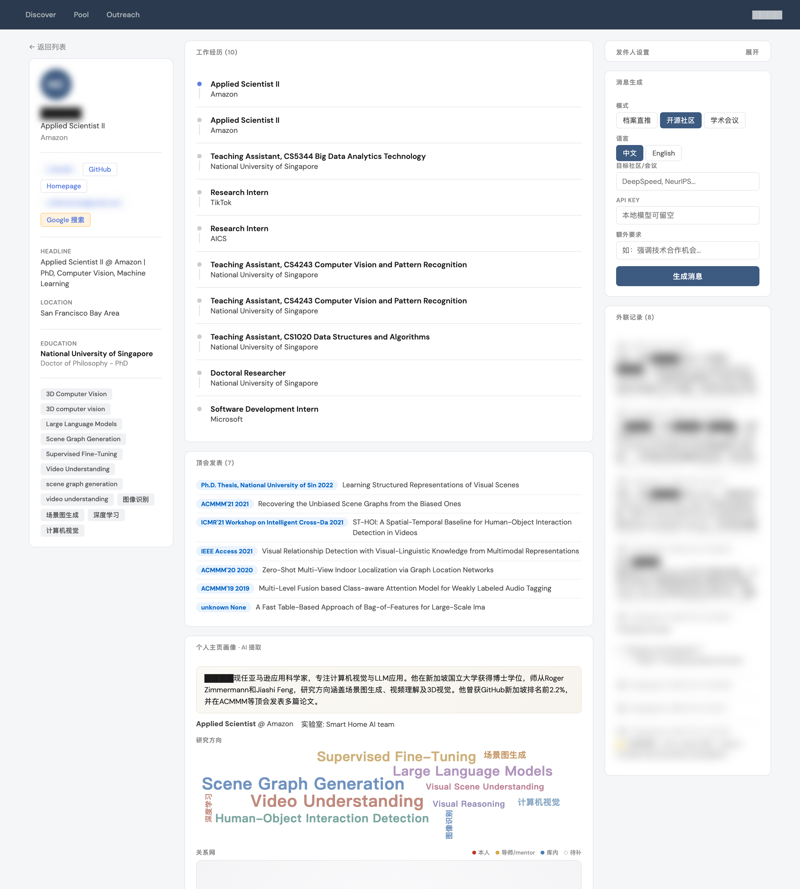

# Recruiting Any

本地优先的 AI 招聘平台。从学术实验室和业界发现候选人，统一管理人才库，生成个性化外联话术——全部在浏览器中完成。





## 核心流程

```
Discover（发现）→  Pool（人才库）→  Outreach（外联）
```

### Discover — 批量发现候选人

- **CSRankings 集成**：按学校搜索 CS 教授，自动提取实验室成员（博士生、博后、研究员）
- **Smart Search**：输入任意教授主页或实验室页面，LLM 自动提取成员信息
- **院系页面抓取**：批量从大学院系页面提取教职信息
- **会议论文**（即将上线）：通过 NeurIPS、ICML、ICLR、ACL、CVPR 等会议论文列表，锁定一作候选人
- 两阶段抓取架构：HTTP 快速抓取 + 单次 LLM 调用提取，成本极低
- 支持 JS 渲染页面、跨域实验室网站、纯图标链接、超长页面智能截断

### Pool — 统一人才库

- 全文搜索（FTS5）、布尔查询、语义匹配
- **All / Academic / Industry** 三个 Tab，一个池子，按需筛选
- 学术视图：按导师、学校、毕业年份、研究方向、Pipeline 状态筛选
- Insights 面板：公司分布、学历分布、院校排名、外联漏斗
- Chrome 插件一键抓取 LinkedIn 档案

### Outreach — 个性化话术生成

- 三种模式：档案直推、开源社区、学术合作
- 中英双语
- 自动拉取候选人完整背景（工作经历、教育、论文）生成个性化消息
- 发件人身份可配置
- 历史记录追踪、搜索、导出

## 快速开始

```bash
git clone https://github.com/alexlxy599/recruiting-any.git
cd recruiting-any
pip install flask anthropic openai requests beautifulsoup4 lxml duckduckgo-search python-dotenv lancedb
```

创建 `.env`（可选）：

```
GITHUB_TOKEN=ghp_...          # GitHub API，提升调用额度
ANTHROPIC_API_KEY=sk-ant-...  # Claude API，用于高质量话术生成
```

启动：

```bash
python app.py
```

访问 http://localhost:5055

## LLM 配置

支持多种 LLM 后端，在侧边栏或各模块内切换：

| 后端 | 适用场景 | 配置方式 |
|------|---------|---------|
| **LM Studio**（本地） | 免费、隐私、快速抓取 | 本地运行，端口 1234 |
| **OpenRouter** | DeepSeek、Qwen、Llama 等 | openrouter.ai 获取 API Key |
| **Anthropic** | 最佳话术质量 + 原生 Web 搜索 | console.anthropic.com 获取 Key |

Discover 抓取用本地模型即可；Outreach 话术生成推荐 Claude。

## 架构

```
SQLite (data.db)  ←→  Flask API  ←→  Web UI
         ↕                ↕
    FTS5 + LanceDB    LLM（Anthropic / OpenAI 兼容 / 本地模型）
```

- **数据全部本地存储**——仅 LLM 调用走云端（可切换 Ollama/LM Studio 实现完全离线）
- 单一 SQLite 数据库，WAL 模式 + FTS5 全文搜索 + LanceDB 向量检索
- 无 React，无构建步骤——原生 HTML/CSS/JS

## 项目结构

```
app.py                  # Flask 路由和 API
db.py                   # 数据库 Schema、迁移、所有 CRUD 操作
fast_scraper.py         # 两阶段实验室抓取器
agent_scraper.py        # Agent 模式 Web 搜索
enrich_academic.py      # 批量从个人主页补全信息
csrankings.py           # CSRankings 数据集成
ai/
  embedder.py           # 向量化 + 语义搜索
templates/              # 页面模板（Discover / Pool / Outreach）
chrome-extension/       # LinkedIn 档案抓取插件
ingest/
  import_csv.py         # CSV 批量导入
```

## 技术栈

- **后端**：Python, Flask, SQLite + FTS5
- **前端**：原生 HTML/CSS/JS, Chart.js
- **抓取**：BeautifulSoup, Requests
- **LLM**：Anthropic SDK, OpenAI SDK（兼容 OpenRouter / LM Studio / Ollama）
- **检索**：LanceDB（向量）、FTS5（全文）、布尔查询解析器
- **数据源**：CSRankings, GitHub API, Semantic Scholar, Google Scholar, DuckDuckGo

## License

Private project. All rights reserved.
